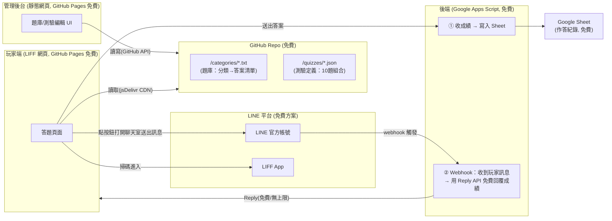

# 現場互動測驗 × LINE 系統 — Project Spec

## 0. 一句話說明

參加者掃描 QRCode → 在 LINE 內開啟一個測驗網頁(LIFF) → 依序作答 10 題選擇題 →
答完立刻在畫面上看到分數 → 同時收到一則 LINE 訊息告知本次成績。
後台則有一個網頁版管理介面，讓你可以：建立/編輯題庫(依類別的答案清單)、
建立測驗(10 題的組合，每題可選「自動生成選項」或「手動輸入選項」)、
產生該場測驗的 QRCode、查看作答紀錄。

**目標：全部功能 100% 免費資源達成。**

---

## 1. 使用情境 Flow

1. 你(管理者)在管理後台建立/更新題庫，例如新增一個分類檔 `高硬度岩石`，
   裡面放：花崗岩、石英岩、玄武岩、輝長岩、片麻岩…
2. 你建立一場新測驗，依序加入 10 題：
   - 第 1 題：類型=自動生成，選類別「高硬度岩石」，正解=「花崗岩」
     → 系統自動從同分類抽 4 個當干擾選項，隨機排入 A~E
   - 第 5 題：類型=手動輸入，題目「以下何種酒精飲料酒精濃度最低？」，
     自己打 A~E 五個選項並勾選正解
3. 存檔後，後台產生這場測驗專屬的 **LIFF 連結 / QRCode**。
4. 現場把 QRCode 印出來貼在攤位/岩石旁，參加者用手機 LINE 掃描。
5. 掃描後直接在 LINE 內開啟測驗頁面(不用額外裝 App、不用註冊帳號，
   用他既有的 LINE 身份即可)。
6. 一次在同一頁看到全部 10 題，可以自由上下捲動、任意修改任何一題的選擇，
   確認無誤後按「送出」。
7. 送出後畫面立刻顯示：「您已完成作答，成績：8/10」。
8. 畫面上同時出現「點我用 LINE 查詢成績」按鈕，點下去會打開與官方帳號的聊天室、
   並自動帶入一句預先打好的訊息，玩家只需要按「送出」：
   → 這個動作觸發後端 webhook，後端立刻**免費**回覆一則訊息到他的 LINE：
   「您已完成作答，成績：8/10」
9. 你可以在管理後台(或直接打開 Google Sheet)同步看到所有人的作答紀錄與統計。

> 為什麼多這一步？因為 LINE 的「主動推播(Push API)」免費方案每月只有 200 則額度，
> 若一個月辦多場活動很容易超過；而「回覆訊息(Reply API)」**完全免費、沒有則數上限**，
> 代價是需要使用者「先傳訊息給官方帳號」才能觸發回覆，所以設計成讓玩家按一下送出鍵。
> 見第 2、8 節。

---

## 2. 整體架構



### 為什麼這樣選

| 需求 | 方案 | 為什麼免費可行 |
|---|---|---|
| QRCode 掃描後直接在 LINE 內開啟網頁 | **LIFF (LINE Front-end Framework)** | LINE 官方帳號本身免費，LIFF 功能免費使用 |
| 答完立刻看到分數 | 分數在 **前端(LIFF 頁面) 直接計算並顯示**，不用等後端 | 純前端運算，零成本、零延遲 |
| 答完 LINE 收到成績訊息 | **Messaging API 的 Reply Message**(玩家主動按鍵送出訊息觸發) | Reply API 完全免費、**無則數上限**，不受單月辦幾場活動影響 |
| 題庫資料庫 | **GitHub Repo 裡的 .txt / .json 檔** | GitHub 免費、版本控制天生就是備份 |
| 讀取題庫給玩家用 | **jsDelivr CDN 讀 GitHub 內容**<br/>`cdn.jsdelivr.net/gh/user/repo/...` | 完全免費、有 CDN 加速、不吃 GitHub API 流量限制 |
| 寫入題庫(管理後台用) | **GitHub REST API**(瀏覽器端直接呼叫) | 免費，只要有存取權杖即可 |
| 收成績 + 呼叫 LINE 推送 + 記錄 | **Google Apps Script Web App** | 完全免費、無冷啟動困擾、機密(LINE Token)存在 Script Properties 很安全 |
| 儲存作答紀錄/統計 | **Google Sheet** | 免費、你自己就能直接開表格看數據，等於免費 dashboard |
| 靜態網頁(管理後台+玩家頁) | **GitHub Pages** | 免費 hosting，綁自訂網域也免費 |

> 整條路徑上沒有任何一個環節需要付費，除非你單場活動 LINE 推播超過 200 人(可以之後再處理)。

---

## 3. 資料結構設計

### 3.1 GitHub Repo 結構

```
quiz-repo/
├── categories/
│   ├── 高硬度岩石.txt        ← 每行一個答案候選
│   ├── 低硬度岩石.txt
│   └── 常見酒類.txt
├── quizzes/
│   ├── rock-challenge-2026.json   ← 一場測驗的完整定義
│   └── drink-quiz-demo.json
└── results/                       ← (可選，若不用Google Sheet也可以存這裡)
```

`categories/高硬度岩石.txt` 範例：
```
花崗岩
石英岩
玄武岩
輝長岩
片麻岩
角閃岩
```

### 3.2 測驗定義 JSON (`quizzes/xxx.json`)

```json
{
  "quizId": "rock-challenge-2026",
  "title": "岩石大挑戰",
  "questions": [
    {
      "id": "q1",
      "mode": "auto",
      "category": "高硬度岩石",
      "answer": "花崗岩",
      "optionCount": 5,
      "options": ["花崗岩", "石英岩", "玄武岩", "輝長岩", "片麻岩"],
      "correctIndex": 0
    },
    {
      "id": "q5",
      "mode": "manual",
      "question": "以下哪種酒精飲料的酒精濃度最低？",
      "options": ["啤酒", "威士忌", "伏特加", "高粱酒", "琴酒"],
      "correctIndex": 0
    }
  ]
}
```

**重點設計：** 自動生成模式(`mode: "auto"`)在**建立測驗當下**就把抽到的 5 個選項
與隨機順序「烤進」JSON 裡(`options` + `correctIndex`)，而不是每次玩家開啟時才重抽。
這樣可以確保：
- 同一場測驗每個人看到的選項是一致的(公平、方便你事後核對)
- 玩家端完全不用知道「自動/手動」邏輯，統一用同一種格式讀取即可
- 你在後台可以先「預覽」自動生成的結果，不滿意可以按「重新抽選項」再存檔

### 3.3 作答紀錄 (Google Sheet 欄位)

| timestamp | quizId | lineUserId | displayName | score | totalQuestions | answersJson |
|---|---|---|---|---|---|---|

---

## 4. 出題模式

### 模式 A：自動生成選項(你現場擺實物的情境)
1. 選一個分類檔(如「高硬度岩石」)
2. 輸入/選擇正解(如「花崗岩」)
3. 選要幾個選項(預設 5 個，A~E)
4. 系統從該分類檔「排除正解後」隨機抽 (N-1) 個當干擾選項，
   全部選項隨機洗牌決定 A~E 順序
5. 後台顯示預覽，可以按「重抽」，滿意後存進該題

### 模式 B：手動輸入選項(如酒精濃度題)
1. 直接打題目文字
2. 手動輸入每個選項文字
3. 勾選哪一個是正解

兩種模式最終都會被存成同一種標準格式(`options` + `correctIndex`)，
玩家端完全不需要區分模式。

---

## 5. 玩家端作答 UI 設計(可改答案 + 防重複)

### 5.1 顯示方式：一次全部顯示 10 題(已定案)
所有題目都在同一頁，玩家可以自由上下捲動、隨時改變任何一題的選擇。
玩家的答案在「正式送出」之前，都只是存在畫面上的暫存狀態(前端 state)，
尚未送到後端、也還沒算分。

### 5.2 送出前一定要有「確認頁(Review)」
在最下方送出按鈕之前，先讓玩家看到一頁**總覽**：
- 列出全部 10 題，每題顯示「你選了：___」
- 每一題旁邊都有「修改」按鈕，點下去可以直接跳回該題重新選
- 未作答的題目要明顯標示(例如紅字「尚未作答」)，避免漏答
- 頁面最下方才是真正的「確認送出」按鈕

按下「確認送出」之後：
1. 前端才開始計分、鎖定畫面(不能再改)
2. 立即在畫面顯示分數
3. 同時把作答內容 POST 給 Apps Script 寫入 Google Sheet
4. 出現「查詢成績」按鈕(見第 1、8 節的 Reply 流程)

### 5.3 送出後防止「重複進行測驗」
- 玩家一開啟 LIFF 頁面(掃 QRCode 進來的當下)，**在看到任何題目之前**，
  前端先用 `liff.getProfile()` 拿到的 `userId` + 網址上的 `quizId`，
  呼叫 Apps Script 的一個查詢端點(`doGet`)，問「這個人在這場測驗是否已經作答過？」
- Apps Script 去 Google Sheet 查有沒有 `(quizId, lineUserId)` 這個組合的紀錄：
  - **有** → 不顯示題目，改顯示「您已完成作答，成績：8/10」，
    並且一樣提供「查詢成績」按鈕(等於重新觸發一次 Reply，方便他忘記分數時再查一次)
  - **沒有** → 正常進入答題流程
- 每場測驗的 JSON 可以加一個欄位 `"allowRetake": false`(預設)，
  如果你有些場合(例如允許同一人多次挑戰、或測試用途)想開放重複作答，
  把這場測驗設成 `"allowRetake": true` 即可繞過檢查——**這個開關由你在建立測驗時決定**。

### 5.4 讓「出題的人」同步看到結果
因為每筆作答一送出就會立刻寫進 Google Sheet 的一列，所以「同步顯示結果」
這件事其實不需要額外開發：
- **最簡單**：你直接打開那個 Google Sheet(手機/電腦都可以)，
  新的作答會即時新增一列，等於免費的即時監控畫面。
- **更好看一點(可選)**：在管理後台加一頁「即時監控」，
  每隔幾秒呼叫 Apps Script 的 `doGet`，把 Sheet 內容整理成表格顯示
  (誰、幾分、什麼時候作答)，還可以標示出「同一人多次嘗試」的異常紀錄，
  方便你現場用手機盯著看。這頁本質上只是包裝過的 Google Sheet 讀取，
  一樣完全免費。

---

## 6. 管理後台 UI 功能清單

- [ ] GitHub 登入(見第 7 節，MVP 版先用 Token 貼上即可)
- [ ] 題庫管理
  - 列出所有分類檔
  - 新增分類、新增/刪除/編輯分類中的項目
- [ ] 測驗管理
  - 建立新測驗、命名
  - 逐題加入(自動/手動兩種模式)，可拖曳排序、刪除、預覽選項
  - 設定是否允許重複作答(`allowRetake`)
  - 儲存(寫回 GitHub)
- [ ] 發布
  - 顯示這場測驗的 LIFF 連結
  - 產生對應的 QRCode 圖片(可下載/列印)
- [ ] 結果查看
  - 嵌入或連結到 Google Sheet，顯示每人分數、平均分、每題答對率
  - (可選)即時監控頁面，每隔幾秒刷新顯示最新作答清單

---

## 7. GitHub 登入怎麼做(兩個版本)

### MVP 版(建議先做這個)
- 管理後台頁面提供一個欄位，貼上你自己產生的 **GitHub Personal Access Token**
  (在 GitHub 網站設定一次，只要打勾 `repo` 權限即可)
- Token 存在瀏覽器 `localStorage`，之後每次操作都用這個 Token 呼叫 GitHub REST API
- 優點：不需要任何後端，10 分鐘可以做完
- 缺點：嚴格說不是「登入」而是「貼金鑰」；且 Token 外流風險要注意
  (只給你自己用、不要把後台網址公開分享出去)

### 進階版(之後可以做)
- 註冊一個 GitHub OAuth App
- 用一個小型 Serverless Function(例如 Cloudflare Workers，免費額度每天 10 萬次請求)
  處理 OAuth 的「授權碼換 Token」這一步(這步驟需要 Client Secret，不能放在瀏覽器)
- 使用者點「使用 GitHub 登入」→ 導去 GitHub 授權頁 → 導回來 → 後台自動拿到 Token
- 優點：真正的登入體驗，也可以之後開放給其他協作者用
- 缺點：多一個後端元件要維護

**建議：先做 MVP 版把整個系統跑起來，之後有需要再升級成 OAuth。**

### 7.3 多人協作：官方帳號是你的，但題庫/測驗由別人維護
這個架構天生就把「LINE 官方帳號」跟「題庫/測驗管理」這兩件事分開，完全不衝突：

- **LINE 官方帳號、Channel Access Token、Webhook 設定** → 只有你(帳號擁有者)碰得到，
  這些憑證只存在你的 Google Apps Script(Script Properties)裡，管理後台完全不會用到它們
- **建立題庫/測驗的人** → 只需要 GitHub 的存取權：
  1. 把他加為你 GitHub Repo 的 **Collaborator**(免費，public/private 皆可、不限人數)
  2. 他用自己的 GitHub 帳號產生一組 Personal Access Token(MVP 版)，
     貼到你給他的管理後台網址上，就能用自己的身份讀寫題庫/測驗
  3. 之後升級成 OAuth 版(Phase 4)，他可以直接「用 GitHub 登入」，體驗更好
  4. 想收回權限，直接把他從 Collaborator 移除即可
- **想查看作答結果的人** → 把 Google Sheet 分享給他的 Google 帳號(檢視或編輯權限皆免費)

也就是說，你可以放心把「管理後台」的網址跟操作方式教給別人，
不用擔心他會因此拿到你的 LINE 官方帳號控制權。

---

## 8. LINE 端設定重點

1. 申請 **LINE 官方帳號**(免費)
2. 在 **LINE Developers Console** 底下建立 **Messaging API Channel**(免費)
3. 在同一個 Channel 底下建立 **LIFF App**，指定你的玩家答題頁 URL
   (例如 `https://<你的帳號>.github.io/quiz-repo/play/`)
4. 拿到：
   - `Channel Access Token`(給 Google Apps Script 呼叫 Push API 用，存在 Script Properties)
   - `LIFF ID`(前端 `liff.init({ liffId })` 用)
5. QRCode 就是 `https://liff.line.me/{liffId}?quizId=rock-challenge-2026` 這個網址轉成的 QRCode
   (一個 LIFF App 可以透過網址參數 `quizId` 重複用在不同場測驗上，不用每場都申請新的 LIFF)
6. **重要**：不管 Push 或 Reply，都需要玩家「已加你官方帳號為好友」才能收到訊息。
   建議在 LIFF 頁面第一步偵測是否已加好友，沒加的話先引導加好友再進入答題
   (LIFF 有內建的「加入好友」提示功能)。
7. 在 LINE Developers Console 設定 **Webhook URL**，指向你的 Google Apps Script
   Web App 網址(`doPost` 端點)，並打開「Use webhook」。
8. 「查詢成績」按鈕的實作方式：LIFF 頁面用
   `liff.openWindow({ url: "https://line.me/R/oaMessage/@你的官方帳號ID/?" + encodeURIComponent("查詢成績 " + resultToken) })`
   打開聊天室並預帶文字，玩家按「送出」後：
   - LINE 觸發 webhook，帶著這則訊息的 `replyToken` 與使用者 `userId`
   - Apps Script 用 `resultToken`(或直接用 `userId` 查最新一筆紀錄)從 Google Sheet
     撈出對應分數，組成訊息文字
   - 呼叫 Reply API，把 `replyToken` 換成一則免費訊息送出(需在收到後 **30 秒內、且只能用一次**)

---

## 9. 建議開發階段(Roadmap)

**Phase 0 — LINE/GitHub 基礎設定**
1. 到 [account.line.biz](https://account.line.biz/) 用個人 LINE 帳號申請一個新的
   **LINE 官方帳號**(選「輕用量(免費)」方案即可，之後隨時可升級)
2. 到 [LINE Developers Console](https://developers.line.biz/) 幫這台官方帳號
   啟用 **Messaging API**(會自動產生對應的 Provider / Channel)
3. 在同一個 Channel 底下建立 **LIFF App**，拿到 `LIFF ID` 與 `Channel Access Token`
4. 建立 GitHub Repo

**Phase 1 — 玩家端最小可行版本**
先手動在 GitHub 放一個測試用 `quiz.json`，寫死讀取它的 LIFF 頁面，
能完成：
- 進場先查重(`userId`+`quizId` 有沒有作答紀錄)
- 一次顯示全部 10 題 → **確認頁可改答案** → 確認送出
- 算分 → 畫面顯示「您已完成作答，成績：X/10」→ 呼叫 Apps Script 寫入 Sheet
- 按「查詢成績」按鈕打開聊天室送出訊息 → Webhook 觸發 → Reply API 免費回覆成績
→ 這一步先確認「查重」「改答案」「LINE 收得到成績」這三條路都是通的，
是整個專案風險最高的部分，建議先把 Webhook 設定好並用最陽春的方式測試。

**Phase 2 — 管理後台 MVP**
題庫 CRUD + 測驗 CRUD(Token 版 GitHub 存取，含 `allowRetake` 開關)，
能真正建立一場測驗並產生 QRCode。

**Phase 3 — 結果查看**
串 Google Sheet，後台顯示簡單統計 + (可選)即時監控頁面。

**Phase 4(選做）— GitHub OAuth 真登入、多人協作、題目圖片、計時等進階功能**

---

## 10. 需要你先決定/確認的事

1. GitHub Repo 要 **Public 還是 Private**？
   (Public 的話 jsDelivr 讀取最順；Private 也可以，但讀取要多繞一層，稍微麻煩一點)
2. 可以接受玩家答完後「多按一次送出鍵」來換取完全免費/無上限嗎？
   (若不行，可切回 Push 版，但要留意單月總場次別超過 200 則免費額度)
3. 「防重複作答」被擋下來的人，你希望他看到什麼？
   (只顯示上次分數就好，還是要留一個「聯絡管理者解鎖」的說明文字？)
4. 選項是否需要「每人看到的順序都不同」(目前設計是同一場測驗大家看到的選項/順序一致)？
5. 先做 MVP(Token 版 GitHub)就好，還是一開始就要做到 OAuth 真登入？

---

## 11. 費用/額度小抄

| 項目 | 免費額度 | 是否夠用 |
|---|---|---|
| LINE 官方帳號 + Messaging API(Reply) | **無則數上限，完全免費** | ✅ 不受單月場次影響 |
| LINE 官方帳號 + Messaging API(Push，備案) | 每月 200 則免費 | 僅在改用全自動推播方案時才需注意 |
| LINE LIFF | 完全免費 | ✅ |
| GitHub Repo + Pages | 完全免費 | ✅ |
| jsDelivr CDN(讀GitHub內容) | 完全免費 | ✅ |
| Google Apps Script | 每日執行時間/次數有免費額度，一般小型活動用不完 | ✅ |
| Google Sheet | 完全免費 | ✅ |
